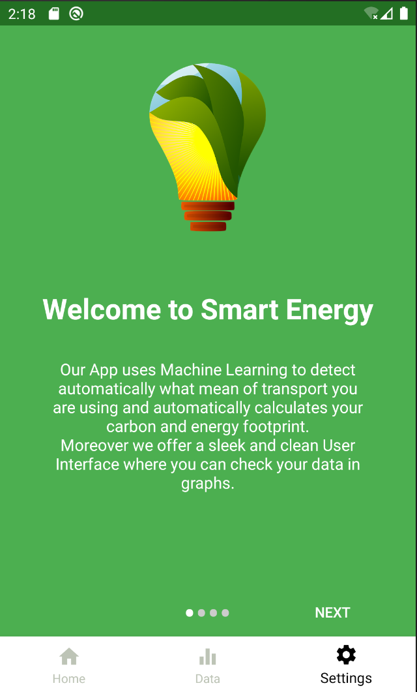
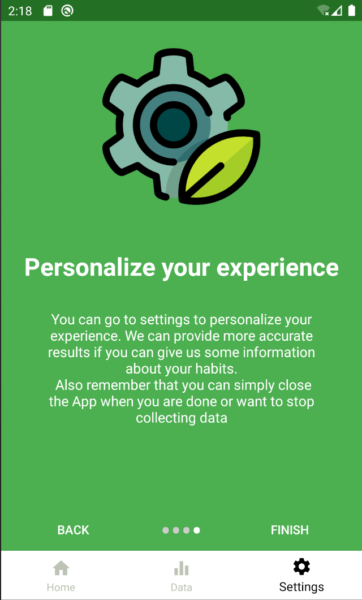
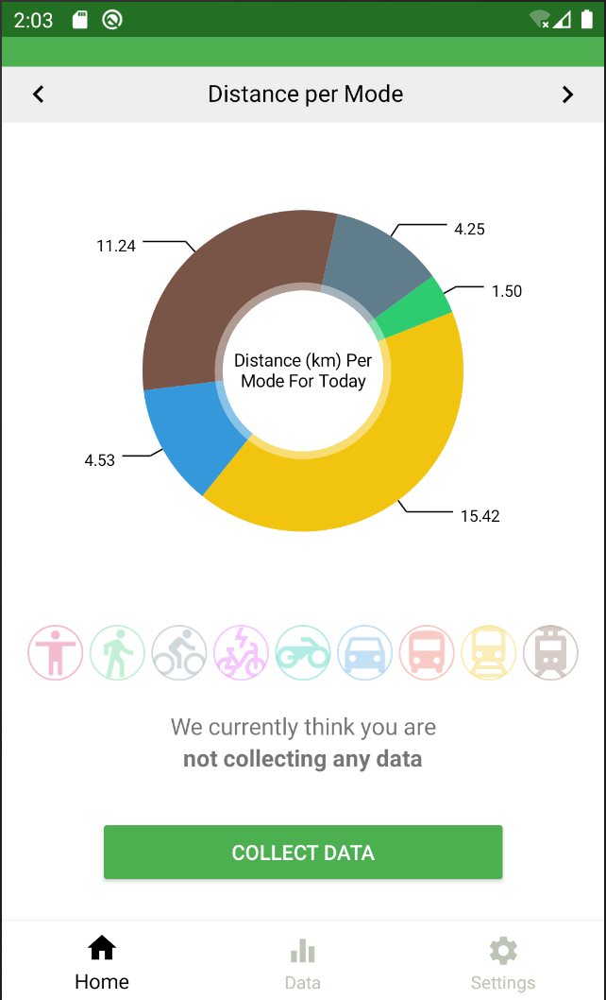
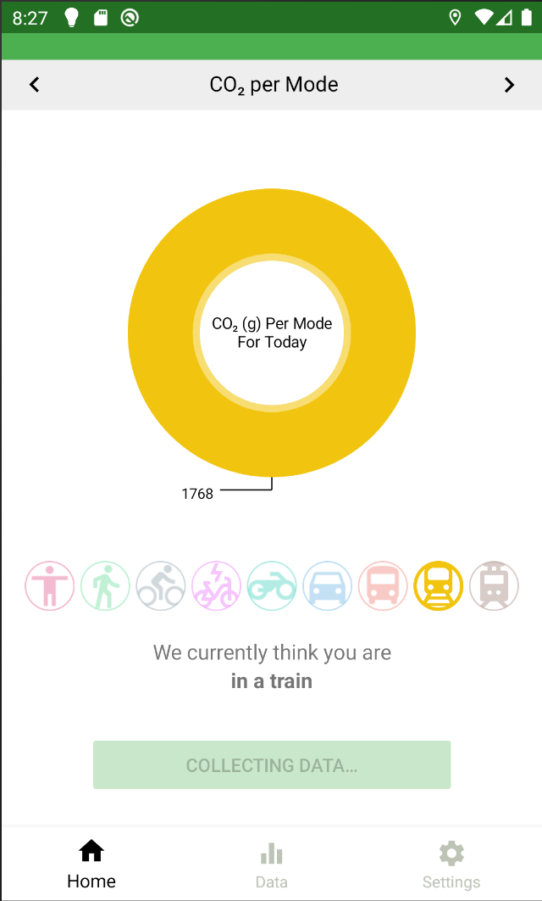

# SmartEnergyApp
### Motivation
Energy use and carbon emissions play an essential role for the climate of planet Earth. It is assumed that providing people information about emissions related to their use of transportation modes will enable them to make more sustainable decisions.
### Description
The focus of this project is to develop a mobile phone application.  This app shall automatically detect when trips start and end. Furthermore, by using various sensor data as an input to a powerful machine learning model, the app predicts the current mode of transportation.  Based on information about the transportation modes the app then calculates  carbon  and  energy  footprint,  distance  and  time related to the modes used during the trip.
### Goal
The goal of this project is to develop a fully functional android prototype app. This includes backend and frontend development. In addition, improving the machine learning model accuracy is vital to the success of such an application. Thus, creating an application to provide people with reliable information about the impact of their behaviour.

# Installation
To Install the App download the apk from here. Please note that you might need to enable Devoleper mode on Android. Also the app, by design, requires constant GPS access which needs to be manually granted by the user from Android 10.

# Screenshots
Splan Screen

  
  

Home Page with info about the current status and today's data.

  
  

